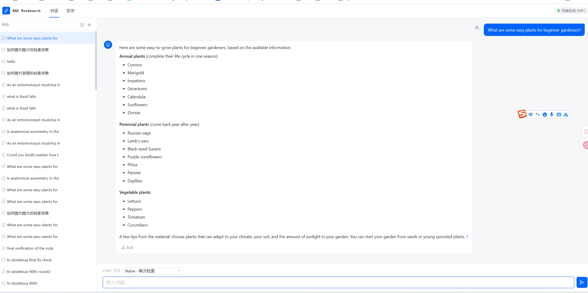
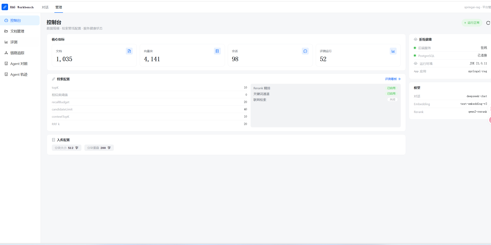
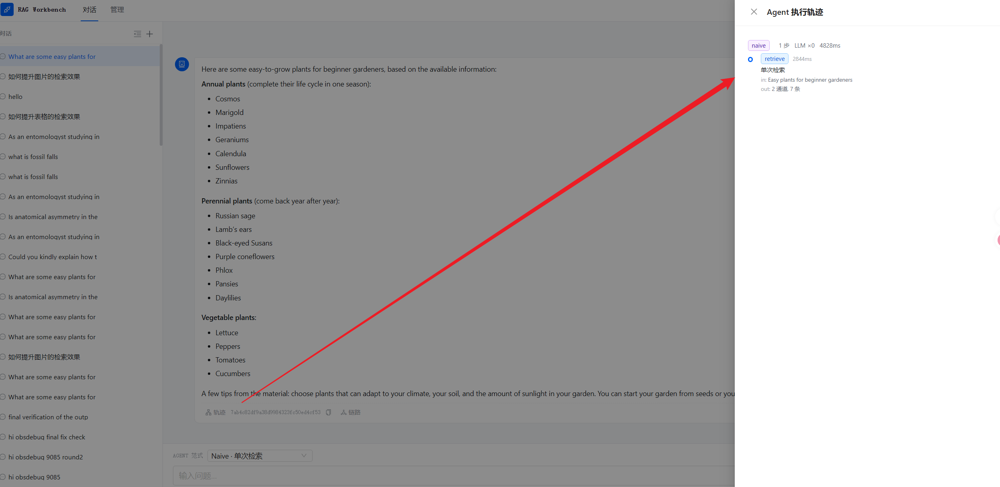
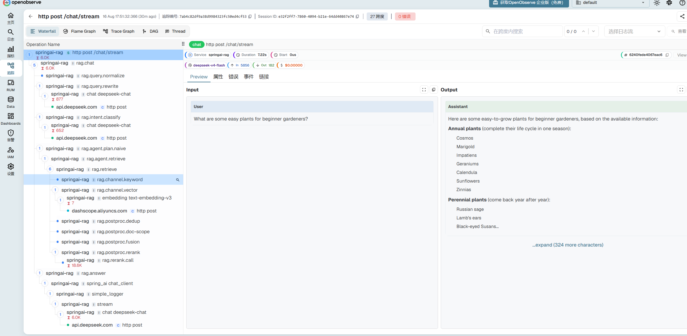

# springai-rag

基于 **Spring AI 1.1** 的 RAG **学习练手项目**：文档入库 → 多通道检索 → Rerank 精排 → 流式问答，并自带全链路可观测性与 RAG 评测。

## 项目说明（学习复刻 demo）

本项目的检索与文档入库能力复刻自 **ragent** 项目，用 **Spring AI 生态**（ChatClient / EmbeddingModel / VectorStore / ChatMemory / Advisor）替代原 ragent 的 infra-ai 层（屏蔽模型供应商），是对 ragent 检索管线与入库编排的学习实践。

- **原项目仓库**：
  - Gitee：https://gitee.com/nageoffer/ragent.git
  - GitHub：https://github.com/nageoffer/ragent.git
- **定位**：本项目为学习复刻的 demo，非 ragent 官方版本；采用 Spring AI 技术栈重写。
- **本项目仓库**：https://gitee.com/apprentice-ol/spring-rag

## 功能特性

- **文档入库**：多格式解析（Tika / Markdown / CSV / MinerU 结构化解析 PDF·Word·PPT）→ Block 模型 → 结构感知分块（标题 / 表格 / 代码 / 图片 / 列表）→ LLM 增强与富化 → VLM 图片描述 → pgvector 向量入库；异步消息队列（RocketMQ / Redis Stream 可切换）、S3 对象存储（RustFS / MinIO）。
- **查询问答**：查询归一化 → 改写 → 意图分类 → 多通道检索（向量 + 关键词 SQL/BM25）→ 去重 → RRF 融合 → Rerank 精排 → 流式回答（SSE）；内置 naive / ReAct 两种 Agent 范式。
- **可观测性**：基于自研组件 **llm-telemetry**（[llm-observability](https://github.com/apprentice-ol/llm-observability)）的 Micrometer OTel 全链路埋点（traceId / spanId），OpenObserve 与 Langfuse 双后端；前端提供控制台、Agent 轨迹、链路追踪视图。
- **RAG 评测**：Recall@k / Precision@k / nDCG / MRR 指标，支持 LiveRAG 评测集导入与跑批。

## 功能截图









## 快速开始

### 环境要求

- JDK 21、Maven 3.9+（后端）
- Node.js 18+（前端构建）
- PostgreSQL 16 + pgvector（可选用 pg_search 扩展开启 BM25 关键词检索）
- Redis 7
- API Key：DeepSeek（对话模型）、阿里云百炼（embedding / rerank / VLM 共用）、可选 MinerU（PDF/Word/PPT 结构化解析）

### 1. 本地开发

```bash
# ① 准备环境变量（真实值只放 .env，不入 git）
cp .env.example .env
# 编辑 .env，至少填写 DEEPSEEK_API_KEY / BAILIAN_API_KEY

# ② 准备数据库：创建 springai_rag 库并启用 pgvector 扩展；
#    业务表由应用启动时自动创建（spring.sql.init，幂等），
#    也可手动执行 rag-core/src/main/resources/sql/init.sql

# ③ 启动后端
cd rag-core
mvn spring-boot:run        # IDEA 启动时 Shorten command line 选 JAR manifest

# ④ 启动前端（另开一个终端）
cd frontend
npm install
npm run dev                # http://localhost:5173
```

### 2. Docker 一键部署

```bash
# ① 构建产物（前端 dist 打进 jar，依赖外置到 lib/）
bash build-local.sh

# ② 把产物放到项目根（app 镜像的 COPY 路径，jar/lib 均被 gitignore）
cp rag-core/target/rag-core-0.0.1-SNAPSHOT.jar .
cp -r rag-core/target/lib .

# ③ 本地启动整套（PostgreSQL / Redis / RustFS / OpenObserve / OTel Collector / App）
docker compose up -d --build

# 服务器部署
docker compose -f docker-compose.server.yml up -d --build
```

完整部署流程（产物上传、.env、账号、端口、表结构迁移、常见运维）见 [docker/README.md](./docker/README.md) 与 [docs/deploy.md](./docs/deploy.md)。

### 验证

- 前端（已打进 jar）：<http://localhost:9081/api/rag/>
- Knife4j 接口文档：<http://localhost:9081/api/rag/doc.html>
- 同步上传文档：`curl -F "file=@xxx.md" http://localhost:9081/api/rag/docs/upload`
- 异步入库：`curl -F "file=@xxx.md" http://localhost:9081/api/rag/docs/upload-async`
- 流式问答（SSE）：前端对话页，或 `GET http://localhost:9081/api/rag/chat/stream?question=xxx`

## 模块结构

```
springai-rag（父聚合 POM）
├── rag-common/   通用基础（exception / context / util / 通用 MQ 抽象）
└── rag-core/     核心业务（依赖 rag-common）
    ├── web/          Controller 与全局异常（chat / ingestion / storage / ping）
    ├── config/      Spring AI 装配、属性配置、Prompt、VLM、S3、Telemetry 维度
    ├── ingestion/   入库引擎（parser / chunk / engine / node / mq / storage / collection）
    ├── chat/        查询引擎（normalize / intent / retrieval / postprocessor / rerank / agent / pipeline）
    ├── eval/        RAG 评测（数据集 / 跑批 / 指标）
    ├── console/     控制台概览
    ├── diagnose/    日志诊断
    └── observe/     可观测性对外接口
```

Spring AI 扮演原 ragent 的 infra-ai 角色（ChatClient / EmbeddingModel / ChatMemory / Advisor），不单独建 infra-ai 模块；pgvector 的写入与检索为手写 JDBC（cosine + HNSW），未依赖 Spring AI VectorStore 抽象。详见 [CLAUDE.md](./CLAUDE.md)。

## 技术栈

| 分类 | 选型 |
|---|---|
| 后端 | Java 21 · Spring Boot 3.5.7 · Spring AI 1.1.2 |
| 存储 | PostgreSQL 16 + pgvector + pg_search（BM25）· Redis 7 · MyBatis Plus |
| 消息 | RocketMQ / Redis Stream（可切换） |
| 对象存储 | RustFS（默认）· MinIO（备选）· 本地文件 |
| 模型 | DeepSeek（chat）· 阿里云百炼 text-embedding-v3（embedding，1024 维）· qwen3-rerank（rerank）· qwen-vl-max（VLM） |
| 前端 | Vue 3 + TypeScript + Ant Design Vue + Vite |
| 可观测 | Micrometer OTel · llm-telemetry（llm-observability）· OpenObserve · Langfuse |
| 其他 | Knife4j 接口文档 · JitPack 依赖（llm-observability） |

## 可观测性组件：llm-telemetry 的集成

本项目的全链路可观测性复用了我的另一个项目 **llm-telemetry**（Maven 发布名 **llm-observability**，经 JitPack 引入），统一承担埋点、上下文传播、后端适配与查询，业务代码不再手写观测逻辑。

### 依赖

在 `rag-core/pom.xml` 中引入两个模块：

```xml
<dependency>
    <groupId>com.github.apprentice-ol.llm-observability</groupId>
    <artifactId>llm-observability</artifactId>
    <version>0.1.1</version>
</dependency>
<dependency>
    <groupId>com.github.apprentice-ol.llm-observability</groupId>
    <artifactId>llm-observability-backends</artifactId>
    <version>0.1.1</version>
</dependency>
```

- `llm-observability`：核心埋点库（注解 / TelemetryTemplate / TelemetryLogger / 上下文传播 / Spring AI 内容捕获 / Starter 自动装配）
- `llm-observability-backends`：后端适配（OpenObserve + Langfuse 配置、直连 exporter、OTLP bridge、Langfuse 数据集/评分 API 客户端）

### 在代码中的用法

| 场景 | 用法 | 本项目示例 |
|---|---|---|
| HTTP 入口（对话根） | `@TelemetryConversation` + `@TelemetryStep` | `ChatController` |
| 同步 / 流式步骤 | `@TelemetryStep`（流式可用 `captureOutput=true`） | `QueryRewriter`、`RagAnswerStreamService`、检索 / 重排 / Agent / 入库 / Eval |
| AOP 盲区（静态方法 / 同类内部调用） | `TelemetryTemplate.step(...)` 手动包一层 | `StreamChatPipeline` 调 `QueryNormalizer` |
| 结构化日志事件（不开 span） | `TelemetryLogger.event` / `TelemetryStructuredLog.emit` | `BaiLianRerankClient` 的 `rerank.scores` |
| 独立后台任务 trace | `@TelemetryStep(kind=ROOT)` / `openTrace` | `EvalRunner` |
| trace 维度自动提取 | `TelemetryTemplate.dimensionOnOutput` | `TelemetryDimensions`（intent、agent 范式） |
| 后端查询 / 编排 | `OpenObserveQueryClient` / `LangfuseApiClient` | `LogDiagnoseService`、`EvalRunner` 评分写回 |

### 配置

- 本地默认使用 `application-telemetry.yaml`：应用 → OTel Collector → OpenObserve + Langfuse；服务器使用 `application-telemetry-server.yaml`：应用直连 OpenObserve（通过 `TELEMETRY_CONFIG` 环境变量切换）。
- 连接信息与凭据统一放 `.env`（`OPENOBSERVE_*` / `LANGFUSE_*` / `TELEMETRY_*`），不写进代码与 git。
- LLM 的 `gen_ai` span 与 token 用量由 Spring AI 原生观测输出，llm-telemetry 负责会话/步骤/维度等业务级信息，并桥接 Spring AI 的 prompt/completion 捕获开关。

详细的埋点规范、span 命名与注意事项见 [docs/llm-observability-guide.md](./docs/llm-observability-guide.md)。

## 当前进度

**已落地：**

- 入库：Fetcher / Parser（Tika · Markdown · CSV · MinerU）/ Chunker（Block-Aware / StructureAware）/ Enricher / Indexer（pgvector）/ 节点日志持久化 / MQ / S3 存储 / 文档集合
- 查询：StreamChatPipeline（归一化 → 改写 → 意图 → 多通道检索 → 去重 → RRF → Rerank → 流式回答）、naive / ReAct Agent、SSE
- 可观测：OTel 埋点 + OpenObserve / Langfuse 双后端，前端控制台 / 轨迹 / 链路视图
- 评测：RAG Eval（Recall@k / Precision@k / nDCG / MRR，LiveRAG 评测集）

**仍为 stub / 默认禁用：**

- `WebSearchChannel`：联网检索通道，未接搜索源
- `EnhancerNode`：`ENHANCER_ENABLED=false` 空跑
- `SiblingExpansionPostProcessor`：代码完整但默认关闭
- `IntentTree` / `QueryTermMapping`：未建

**后续方向：** 评测反馈闭环与参数调优、检索失败自动重试（Self-RAG / Corrective RAG）、文档级 ACL、embedding/查询缓存、向量增量维护（更新/删除同步）、GraphRAG、前端管理后台。

## 提交约定

- pre-commit 钩子（`scripts/check-secrets.sh`）会拦截真实 IP / 账号 / 密码 / API key：示例一律用 `xxx`、`<占位>` 或 `${VAR}`，真实值只放 `.env`（已被 gitignore）。
- clone 后启用钩子：`git config core.hooksPath .githooks`

## 更多文档

- [docs/ingestion-flow.md](./docs/ingestion-flow.md)：入库链路梳理
- [docs/llm-observability-guide.md](./docs/llm-observability-guide.md)：Telemetry 埋点指南
- [docs/logging-guide.md](./docs/logging-guide.md)：日志规范
- [docs/opentelemetry设计思路.md](./docs/opentelemetry设计思路.md)：可观测性设计思路
- [docs/liveRAG评测集.md](./docs/liveRAG评测集.md)：评测集说明
- [CLAUDE.md](./CLAUDE.md)：项目导航（面向 AI 编码助手）
