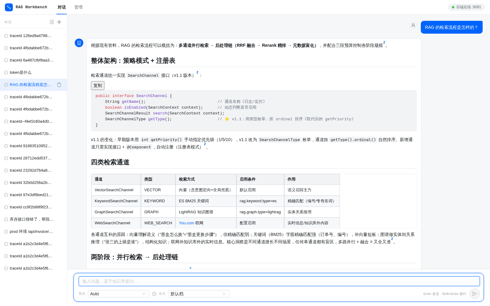
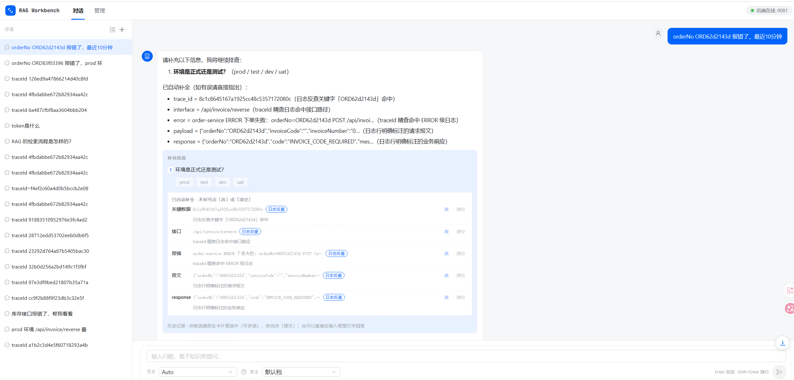
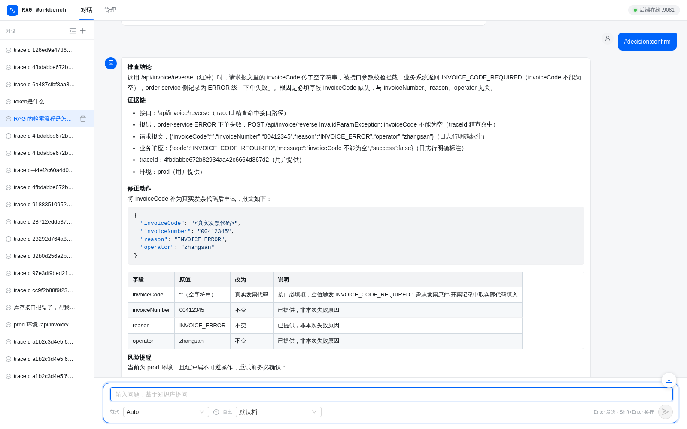
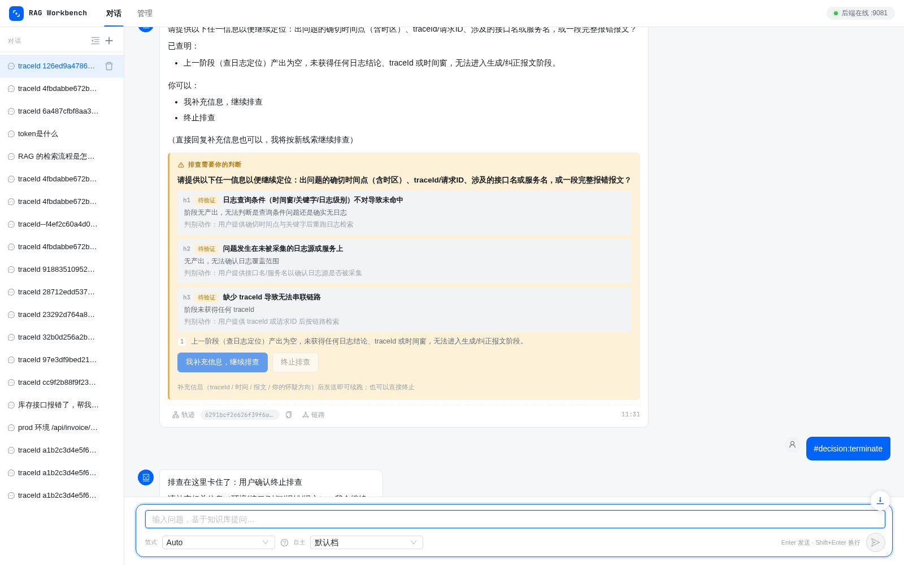
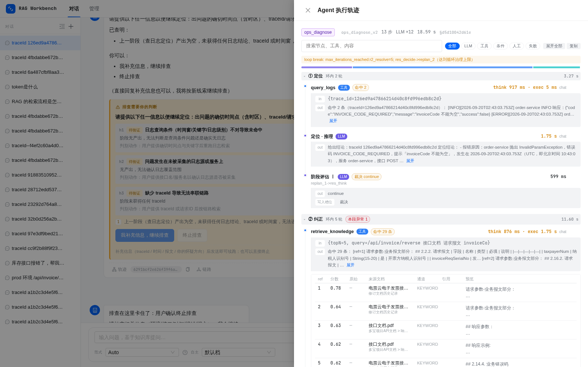
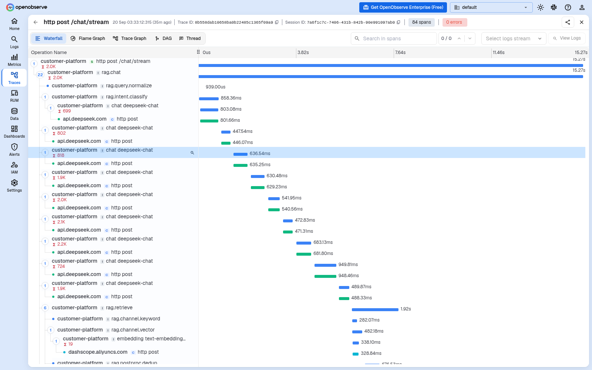
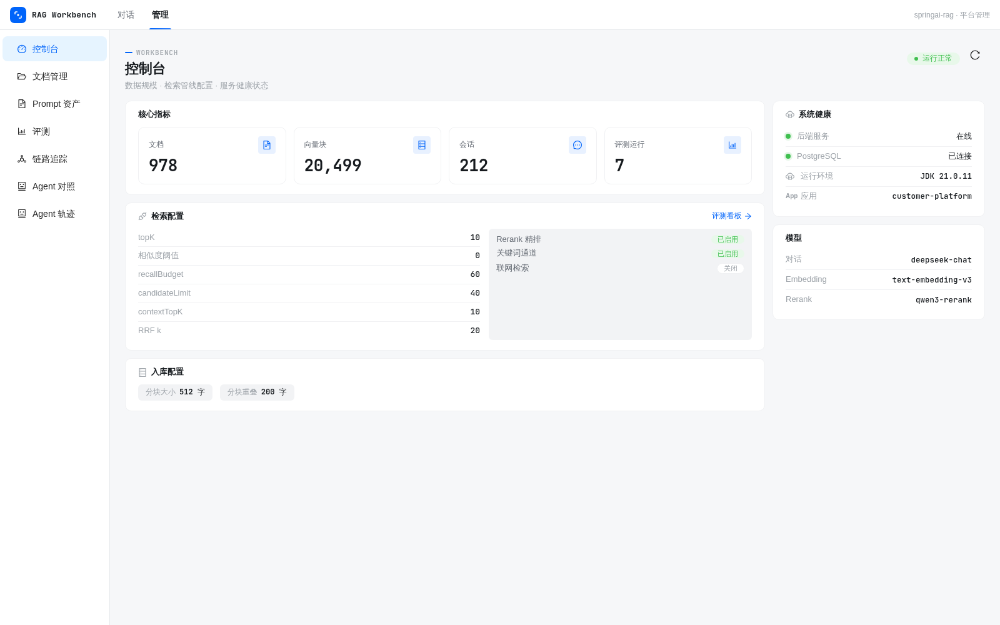
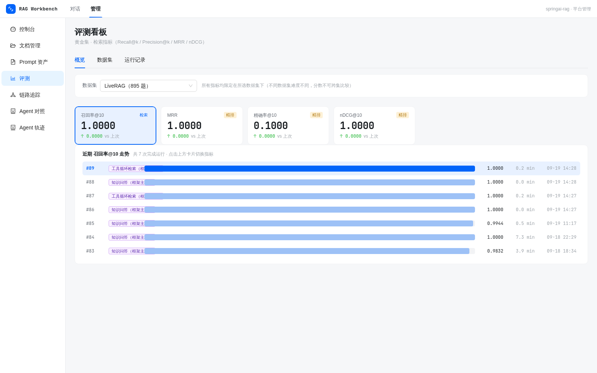

# customer-platform

基于 **Spring AI 1.1** 的 RAG **学习练手项目**：文档入库 → 多通道检索 → Rerank 精排 → 流式问答，并自带全链路可观测性与 RAG 评测。

## 项目说明（学习复刻 demo）

本项目的检索与文档入库能力复刻自 **ragent** 项目，用 **Spring AI 生态**（ChatClient / EmbeddingModel / VectorStore / ChatMemory / Advisor）替代原 ragent 的 infra-ai 层（屏蔽模型供应商），是对 ragent 检索管线与入库编排的学习实践。

- **原项目仓库**：
  - Gitee：https://gitee.com/nageoffer/ragent.git
  - GitHub：https://github.com/nageoffer/ragent.git
- **定位**：本项目为学习复刻的 demo，非 ragent 官方版本；采用 Spring AI 技术栈重写。
- **本项目仓库**：https://gitee.com/apprentice-ol/spring-rag

## 功能特性

- **文档入库**：多格式解析（Tika / Markdown / CSV / MinerU 结构化解析 PDF·Word·PPT）→ Block 模型 → 结构感知分块（标题 / 表格 / 代码 / 图片 / 列表）→ LLM 增强与富化 → VLM 图片描述 → pgvector 向量入库；异步消息队列（RocketMQ / Redis Stream 可切换）、S3 对象存储（RustFS / MinIO）。
- **知识问答**：查询归一化 → 改写 → 意图分类 → 多通道检索（向量 + 关键词 SQL/BM25）→ 去重 → RRF 融合 → Rerank 精排 → 流式回答（SSE）；两种检索范式可选——`knowledge`（单次检索直出，评测基线）/ `react_loop`（工具循环检索：检索 → 自评 → 决定何时停）。
- **运维诊断**：对着业务日志排故障，全流程沉淀为可审计的结论——槽位抽取 → **自主补全**（规则 / 模型推断 / 日志反查，问用户之前先自救）→ 确认门（摊开每项的来源与依据，可逐项纠正）→ **三阶段工具循环**（查日志定位 → 生成或纠正报文 → 确定性校验）→ 四段式结论（排查结论 / 证据链 / 修正动作 / 风险提醒）。
  - **两种反查方式**：标准 traceId 全链路精查；业务键（orderNo / 流水号 / requestId）当关键字模糊查，命中后自动回填真实 traceId。
  - **人在环中**：缺信息先问齐；模型拿不准时挂起**决策移交**（附竞争假设与判别动作，终止是选项之一而非默认结局）；自主档位 L1/L2/L3 可调。
  - **结论可追问**：结论交付后用户仍可追问——解释类追问走轻量直答（引主张编号）、查文档走针对性检索、质疑/新事实才重跑排查；主张台账支持逐条否定与取代（区分"被更新"与"被推翻"两种审计事实）。
- **可观测性**：基于自研组件 **llm-telemetry**（[llm-observability](https://github.com/apprentice-ol/llm-observability)）的 Micrometer OTel 全链路埋点（traceId / spanId），OpenObserve 与 Langfuse 双后端；前端提供控制台、Agent 轨迹、链路追踪视图。
- **RAG 评测**：Recall@k / Precision@k / nDCG / MRR 指标，支持 LiveRAG 评测集导入与跑批。

## 功能截图

**知识问答** —— 引用溯源（角标）+ Markdown 渲染（代码块 / 表格），答案只基于检索到的资料：



**运维诊断 · 自主补全** —— 用户只给一个业务单号（真实排查里常常是唯一线索）：
系统判定它不是标准 traceId、当关键字模糊查日志，命中后**回填真实 traceId**，
并连带补出接口 / 报错 / 报文 / 响应——每项都标注来源（「日志反查」），可逐项「改 / 清空」纠正：



**运维诊断 · 四段式交付** —— 排查结论 / 证据链（每条标注来源）/ 修正动作（含字段改动表）/ 风险提醒：



**人在环中** —— 模型拿不准时挂起决策移交：把竞争假设连同**判别动作**一起摊开，
「终止排查」是选项之一而非默认结局：



**执行轨迹** —— 每轮问答与诊断的过程可回溯：阶段分组、工具调用 in/out、检索命中明细、循环治理告警：



**链路追踪（OpenObserve）** —— 气泡上的「链路」按钮直达该轮对话的全链路瀑布图：
HTTP 入口 → 对话编排 → 意图分类 → LLM 调用（含 token 用量）→ 检索通道 → embedding → 向量库，
每一步的耗时与跨服务调用（DeepSeek / DashScope）都可下钻：



**控制台** —— 数据规模、检索管线配置、服务健康与模型清单：



**评测看板** —— 黄金集检索指标（Recall@k / Precision@k / MRR / nDCG）+ 多范式对照：



## 快速开始

### 环境要求

- JDK 21、Maven 3.9+（后端）
- Node.js 18+（前端构建）
- PostgreSQL 16 + pgvector（可选用 pg_search 扩展开启 BM25 关键词检索）
- Redis 7
- API Key：DeepSeek（对话模型）、阿里云百炼（embedding / rerank / VLM 共用）、可选 MinerU（PDF/Word/PPT 结构化解析）

### 1. 本地开发

```bash
# ① 准备环境变量（真实值只放 .env，不入 git）
cp .env.example .env
# 编辑 .env，至少填写 DEEPSEEK_API_KEY / BAILIAN_API_KEY

# ② 准备数据库：创建 springai_rag 库并启用 pgvector 扩展；
#    业务表由应用启动时自动创建（spring.sql.init，幂等），
#    也可手动执行 platform-bootstrap/src/main/resources/sql/init.sql

# ③ 启动后端（唯一可执行模块 platform-bootstrap）
#    方式一（推荐）：IDEA 直接运行 PlatformApplication
#      Run Configuration → Shorten command line 选【JAR manifest】
#      （依赖多，默认方式会超 Windows 命令行长度上限）
#    方式二：命令行跑瘦 jar（pom 跳过 repackage，产物 = lib/ 依赖目录 + 瘦 jar）
mvn -DskipTests install
java -cp "platform-bootstrap/target/lib/*;platform-bootstrap/target/platform-bootstrap-0.0.1-SNAPSHOT.jar" \
     com.jjx.customer.platform.PlatformApplication
#    ⚠️ `mvn spring-boot:run` 在本项目不可用：pom 为产瘦 jar 给该插件配了 skip=true，
#       run goal 被一并跳过——表现为 BUILD SUCCESS 但不启动；带 -am 则先在父 POM 上报"找不到主类"。

# ④ 启动前端（另开一个终端）
cd frontend
npm install
npm run dev                # http://localhost:5173
```

### 2. Docker 一键部署

```bash
# ① 构建产物（前端 dist 打进 jar，依赖外置到 lib/，并同步到项目根）
bash build-local.sh

# ② 本地启动整套（PostgreSQL / Redis / RustFS / OpenObserve / OTel Collector / App）
docker compose up -d --build

# 服务器部署
docker compose -f docker-compose.server.yml up -d --build
```

完整部署流程（产物上传、.env、账号、端口、表结构迁移、常见运维）见 [docker/README.md](./docker/README.md) 与 [docs/deploy.md](./docs/deploy.md)。

### 验证

- 前端（已打进 jar）：<http://localhost:9081/api/rag/>
- Knife4j 接口文档：<http://localhost:9081/api/rag/doc.html>
- 同步上传文档：`curl -F "file=@xxx.md" http://localhost:9081/api/rag/docs/upload`
- 异步入库：`curl -F "file=@xxx.md" http://localhost:9081/api/rag/docs/upload-async`
- 流式问答（SSE）：前端对话页，或 `GET http://localhost:9081/api/rag/chat/stream?question=xxx`

### 灌测试数据（运维诊断）

运维诊断的日志反查读 OpenObserve，而默认流是平台自身日志、没有业务异常。
`scripts/seed-oo-log.sh` 往流里灌一条业务异常日志（含接口路径、请求报文、业务响应）：

```bash
bash scripts/seed-oo-log.sh                          # 随机 traceId / orderNo + 默认关键字
bash scripts/seed-oo-log.sh <traceId> <关键字> <服务名> <orderNo>
```

灌完脚本会打印三种测法（都在对话页输入）：

| 测法 | 输入 | 反查路径 |
|---|---|---|
| traceId 精查 | `traceId <32位hex> 帮我看看为什么失败` | 全链路精查（不受时间窗限制） |
| 中文关键字 | `<关键字>，最近10分钟` | 关键字模糊查 |
| **业务键** | `orderNo <orderNo> 报错了，最近10分钟` | 业务键模糊查 → 命中后**回填真实 traceId** → 再精查 |

反查要求「关键字 + 时间窗」都有；body 进 OpenObserve 视图会被截到 200 字，
脚本已把关键字（含 orderNo）放在正文前 40 字内，写在报文末尾的搜不到。

## 模块结构

按「框架 / 能力域 / 业务域」分层，15 个 Maven 模块：

```
customer-platform（父聚合 POM，包根 com.jjx.customer.platform）
├── 框架层（零业务依赖，可独立成仓）
│   └── platform-agent-core       内核（包根 com.agentframework）：engine / definition /
│                                 crosscutting / runtime / infra / extension / sdk
├── 基础设施层
│   ├── platform-common           util / mybatis 类型处理器 / 分页 DTO
│   └── platform-shared           配置属性 / Prompt 加载 / 模型与 HTTP 装配 + 跨域 SPI
├── 能力域层
│   ├── platform-cache            CacheStore / Redis 装配 / 频率准入
│   ├── platform-observe          OpenObserve / Langfuse / TraceSampling
│   ├── platform-storage          S3 对象存储 + 文件元数据
│   ├── platform-knowledge        多通道检索 / 融合 / 重排 / 后处理 + RAG 生成
│   ├── platform-prompt           Prompt 资产 / 版本 / 能力包与绑定
│   └── platform-ingestion        解析 / 分块 / 增强 / 富化 + 文档目录
├── 业务层（调度 + 交付）
│   ├── platform-business         ★ 业务/调度：engine（内核桥接）/ workflow/common（共用节点）
│   │                             / knowledge（RAG 线）/ ops（诊断线）/ orchestration（决策骨架）
│   ├── platform-delivery          交付通道：sse / message / runtime / service / rest
│   ├── platform-mcp               MCP 扩展工具来源
│   └── platform-eval              评测：数据集 / 跑批 / 指标 / 对照 / 外部推送
└── 收口
    ├── platform-console           控制台视图 / 全局异常 / AgentRegistry
    └── platform-bootstrap         唯一可执行装配点：启动类 / yaml / sql / static / OpenApi
```

依赖方向是硬约束：`bootstrap → 业务域 → 能力域 → shared → common`；业务域之间只经 `platform-shared`
的 SPI（`DeliveryPort` / `ConversationStore` / `DocumentCatalog` 等）通信，不互相 import 实现。

Spring AI 扮演原 ragent 的 infra-ai 角色（ChatClient / EmbeddingModel / ChatMemory / Advisor），
不单独建 infra-ai 模块；pgvector 的写入与检索为手写 JDBC（cosine + HNSW），未依赖 Spring AI VectorStore 抽象。
详见 [CLAUDE.md](./CLAUDE.md) 与 [docs/project-structure.md](./docs/project-structure.md)。

## 技术栈

| 分类 | 选型 |
|---|---|
| 后端 | Java 21 · Spring Boot 3.5.7 · Spring AI 1.1.2 |
| 存储 | PostgreSQL 16 + pgvector + pg_search（BM25）· Redis 7 · MyBatis Plus |
| 消息 | RocketMQ / Redis Stream（可切换） |
| 对象存储 | RustFS（默认）· MinIO（备选）· 本地文件 |
| 模型 | DeepSeek（chat）· 阿里云百炼 text-embedding-v3（embedding，1024 维）· qwen3-rerank（rerank）· qwen-vl-max（VLM） |
| 前端 | Vue 3 + TypeScript + Ant Design Vue + Vite |
| 可观测 | Micrometer OTel · llm-telemetry（llm-observability）· OpenObserve · Langfuse |
| 其他 | Knife4j 接口文档 · JitPack 依赖（llm-observability） |

## 可观测性组件：llm-telemetry 的集成

本项目的全链路可观测性复用了我的另一个项目 **llm-telemetry**（Maven 发布名 **llm-observability**，经 JitPack 引入），统一承担埋点、上下文传播、后端适配与查询，业务代码不再手写观测逻辑。

### 依赖

在 `platform-bootstrap/pom.xml`（可执行装配点）中引入两个模块：

```xml
<dependency>
    <groupId>com.github.apprentice-ol.llm-observability</groupId>
    <artifactId>llm-observability</artifactId>
    <version>0.1.1</version>
</dependency>
<dependency>
    <groupId>com.github.apprentice-ol.llm-observability</groupId>
    <artifactId>llm-observability-backends</artifactId>
    <version>0.1.1</version>
</dependency>
```

- `llm-observability`：核心埋点库（注解 / TelemetryTemplate / TelemetryLogger / 上下文传播 / Spring AI 内容捕获 / Starter 自动装配）
- `llm-observability-backends`：后端适配（OpenObserve + Langfuse 配置、直连 exporter、OTLP bridge、Langfuse 数据集/评分 API 客户端）

### 在代码中的用法

| 场景 | 用法 | 本项目示例 |
|---|---|---|
| HTTP 入口（对话根） | `@TelemetryConversation` + `@TelemetryStep` | `ChatController` |
| 同步 / 流式步骤 | `@TelemetryStep`（流式可用 `captureOutput=true`） | `QueryRewriter`、`RagAnswerStreamer`、检索 / 重排 / Agent / 入库 / Eval |
| AOP 盲区（静态方法 / 同类内部调用） | `TelemetryTemplate.step(...)` 手动包一层 | `ChatOrchestrator` 调 `QueryNormalizer` |
| 结构化日志事件（不开 span） | `TelemetryLogger.event` / `TelemetryStructuredLog.emit` | `BaiLianRerankClient` 的 `rerank.scores` |
| 独立后台任务 trace | `@TelemetryStep(kind=ROOT)` / `openTrace` | `EvalRunner` |
| trace 维度自动提取 | `TelemetryTemplate.dimensionOnOutput` | `TelemetryDimensions`（intent、agent 范式） |
| 后端查询 / 编排 | `OpenObserveQueryClient` / `LangfuseApiClient` | `LogDiagnoseService`、`EvalRunner` 评分写回 |

### 配置

- 本地默认使用 `application-telemetry.yaml`：应用 → OTel Collector → OpenObserve + Langfuse；服务器使用 `application-telemetry-server.yaml`：应用直连 OpenObserve（通过 `TELEMETRY_CONFIG` 环境变量切换）。
- 连接信息与凭据统一放 `.env`（`OPENOBSERVE_*` / `LANGFUSE_*` / `TELEMETRY_*`），不写进代码与 git。
- LLM 的 `gen_ai` span 与 token 用量由 Spring AI 原生观测输出，llm-telemetry 负责会话/步骤/维度等业务级信息，并桥接 Spring AI 的 prompt/completion 捕获开关。

详细的埋点规范、span 命名与注意事项见 [docs/llm-observability-guide.md](./docs/llm-observability-guide.md)。

## 当前进度

**已落地：**

- **入库**：Fetcher / Parser（Tika · Markdown · CSV · MinerU）/ Chunker（Block-Aware / StructureAware）/ Enricher / Indexer（pgvector）/ 节点日志持久化 / MQ / S3 存储 / 文档集合
- **知识问答**：ChatOrchestrator（归一化 → 改写 → 意图 → 多通道检索 → 去重 → RRF → Rerank → 流式回答）、`knowledge` / `react_loop` 两种范式、SSE 流式、引用溯源
- **运维诊断**：`ops_diagnose` 工作流（槽位 → 自主补全 → 确认门 → 三阶段工具循环 → 四段式结论）、人在环中（问齐 / 决策移交 / 自主档位 / 来源溯源）、任务与主张台账（结论可追问、可逐条否定）、追问分级（直答 / 针对性检索 / 重跑）
- **缓存**：五层（意图 / 检索 / 日志工具 / 精确答案 / 语义答案）+ 频率准入 + Redis 断路器联动降级
- **可观测**：OTel 埋点 + OpenObserve / Langfuse 双后端，前端控制台 / 轨迹 / 链路视图
- **评测**：RAG Eval（Recall@k / Precision@k / nDCG / MRR，LiveRAG 评测集）

**仍为 stub / 默认禁用：**

- `WebSearchChannel`：联网检索通道，未接搜索源
- `EnhancerNode`：`ENHANCER_ENABLED=false` 空跑
- `SiblingExpansionPostProcessor`：代码完整但默认关闭
- `IntentTree` / `QueryTermMapping`：未建

**后续方向：** 评测反馈闭环与参数调优、检索失败自动重试（Self-RAG / Corrective RAG）、文档级 ACL 与多租户、向量增量维护（更新/删除同步）、GraphRAG、前端管理后台。

## 提交约定

- pre-commit 钩子（`scripts/check-secrets.sh`）会拦截真实 IP / 账号 / 密码 / API key：示例一律用 `xxx`、`<占位>` 或 `${VAR}`，真实值只放 `.env`（已被 gitignore）。
- clone 后启用钩子：`git config core.hooksPath .githooks`

## 更多文档

- [docs/project-structure.md](./docs/project-structure.md)：模块结构与依赖方向
- [docs/ingestion-flow.md](./docs/ingestion-flow.md)：入库链路梳理
- [docs/deploy.md](./docs/deploy.md) · [docker/README.md](./docker/README.md)：部署与运维
- [docs/llm-observability-guide.md](./docs/llm-observability-guide.md)：Telemetry 埋点指南
- [docs/logging-guide.md](./docs/logging-guide.md)：日志规范
- [docs/opentelemetry设计思路.md](./docs/opentelemetry设计思路.md)：可观测性设计思路
- [docs/liveRAG评测集.md](./docs/liveRAG评测集.md)：评测集说明
- [plan/](./plan/)：设计计划与落地记录（诊断循环 / 上下文架构 / Task 层 / 人在环中 …）
- [scripts/](./scripts/)：`seed-oo-log.sh` 灌测试日志、`check-secrets.sh` 提交前密钥检查
- [CLAUDE.md](./CLAUDE.md)：项目导航（面向 AI 编码助手）
